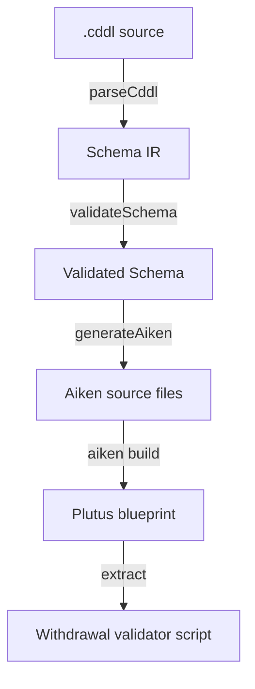
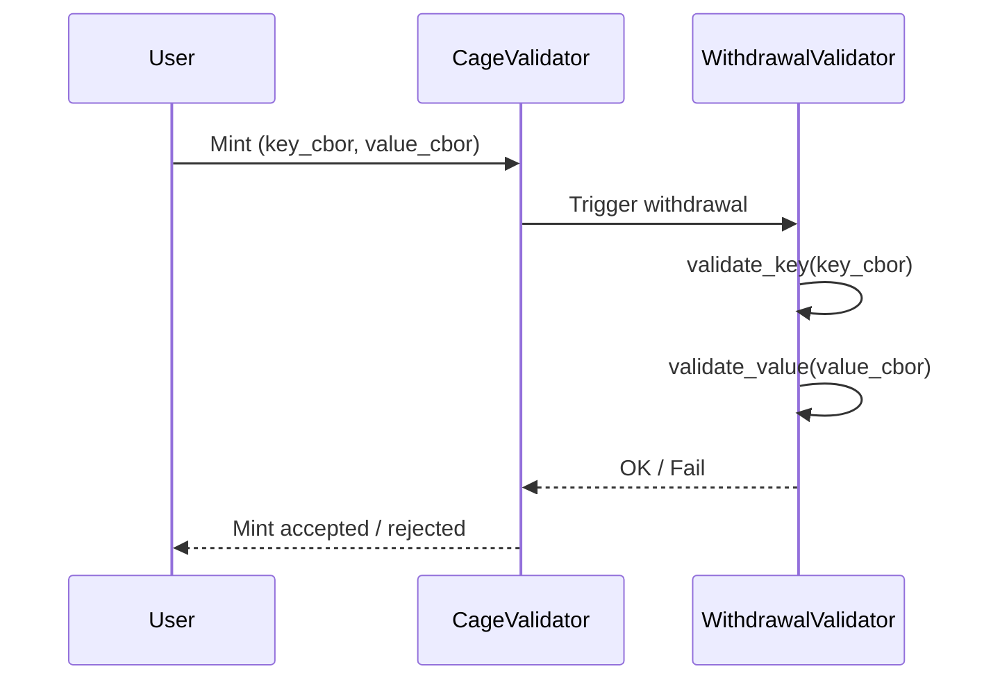

# Architecture

## Pipeline



## Modules

### `CddlAiken.Cddl.Parser`

Megaparsec-based parser that converts CDDL text into the internal representation. Extracts the `key` and `value` top-level rules and builds a `Schema` value.

### `CddlAiken.Cddl.Types`

The intermediate representation:

```
Schema
├── schemaKey   :: CborSchema
└── schemaValue :: CborSchema

CborSchema
├── CUint (Maybe Constraint)
├── CInt (Maybe Constraint)
├── CTstr (Maybe SizeConstraint)
├── CBstr (Maybe SizeConstraint)
├── CBool
├── CNull
├── CMap [MapEntry]
├── CArray [CborSchema]
├── CChoice [CborSchema]
└── CRef Text
```

### `CddlAiken.Aiken.Cbor`

Static Aiken source for a CBOR parsing library. Emitted as `lib/cbor.ak` in every generated project. Provides:

- `read_header` — decodes CBOR major type and argument
- `parse_uint`, `parse_int`, `parse_bstr`, `parse_tstr`, `parse_bool`, `parse_null`
- `parse_map_header`, `parse_array_header`
- `skip_value`, `skip_n` — position advancement for skipping values

### `CddlAiken.Aiken.Generator`

Transforms the IR into Aiken validator code. Key decisions:

- **Canonical CBOR ordering**: map keys are sorted by encoded bytes at compile time, so the validator can match keys sequentially without backtracking
- **Optional fields**: checked via map entry count — if `count > required`, try parsing the optional key at the current position
- **Constraints**: emitted as `expect` assertions after parsing the value

### `CddlAiken.Compiler`

Thin orchestration layer: parse → validate → generate. Returns a list of `(FilePath, Text)` pairs.

## Generated validator structure

```aiken
use cbor.{ParseResult, parse_map_header, parse_tstr, parse_uint, ...}

fn validate_key(bytes: ByteArray, pos: Int) -> Int {
  // Parse map header, check entry count
  // For each key in canonical order:
  //   parse key string, expect match
  //   parse and validate value
  // Return final position
}

fn validate_value(bytes: ByteArray, pos: Int) -> Int {
  // Same structure as validate_key
}

validator cddl_schema {
  withdraw(redeemer: Data, _account: Credential, _self: Transaction) {
    expect (key_bytes, value_bytes): (ByteArray, ByteArray) = redeemer
    let key_end = validate_key(key_bytes, 0)
    expect key_end == builtin.length_of_bytearray(key_bytes)
    let value_end = validate_value(value_bytes, 0)
    expect value_end == builtin.length_of_bytearray(value_bytes)
    True
  }
}
```

The validator receives the key and value as raw byte arrays in the redeemer, parses them according to the schema, and fails if the CBOR doesn't match.

## Integration with MPFS

The generated withdrawal validator is used to parameterize an MPFS cage. At mint time, the cage validator triggers the withdrawal, which forces the Plutus script to validate the CBOR shape of the key/value pair being stored.


