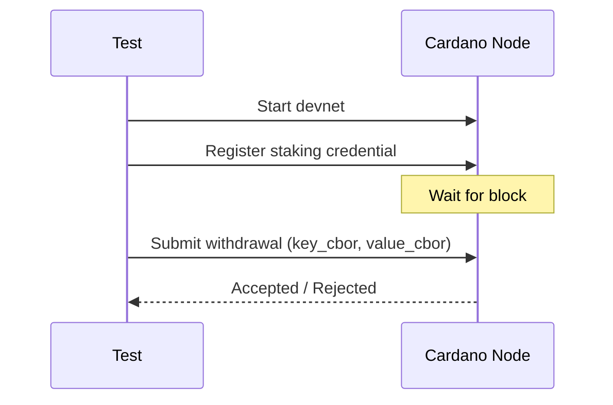

# E2E Testing

The E2E test suite validates compiled withdrawal scripts against a real Cardano devnet.

## How it works

Each test case:

1. Starts a local Cardano node with devnet genesis
2. Connects via Node-to-Client mini-protocols (local state query + local tx submission)
3. Registers a script-based staking credential
4. Submits a withdrawal transaction with CBOR data in the redeemer
5. Asserts acceptance or rejection



## Test cases

### Valid CBOR acceptance

Submits a withdrawal with CBOR matching the schema:

- **Key**: `{"owner": <28 zero bytes>}` — valid map with 28-byte bstr
- **Value**: `{"amount": 1, "payload": <4 bytes>}` — valid map in canonical order

Expected: transaction accepted.

### Invalid CBOR rejection

Submits a withdrawal with invalid CBOR:

- **Key**: `0x05` — a bare uint, not a map
- **Value**: `0x05` — same

Expected: transaction rejected (script execution fails).

## Running locally

```bash
nix develop
cabal test cddl-e2e -O0 --test-show-details=direct
```

The nix shell provides `cardano-node` and sets `E2E_GENESIS_DIR` via the shell hook. Tests take ~18 seconds (mostly devnet startup).

## Transaction construction

The test builds withdrawal transactions manually using cardano-ledger types:

- **Witnesses** are constructed via the `AlonzoTxWits` pattern constructor (not lens setters) to ensure correct CBOR serialization
- **Redeemer**: `List [B key_cbor, B value_cbor]` with conservative ExUnits
- **Script integrity hash**: computed from language views + redeemers
- **Registration**: uses `ConwayRegCert` with implicit deposit (`SNothing`) to avoid requiring a script witness during credential registration

## CI

E2E tests run in GitHub Actions on NixOS runners as part of the standard CI pipeline.
