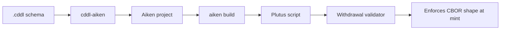

# cddl-aiken

A compiler that turns [CDDL](https://datatracker.ietf.org/doc/html/rfc8610) schema definitions into [Aiken](https://aiken-lang.org/) withdrawal validators for on-chain CBOR validation on Cardano.

## What it does

MPFS cages store arbitrary CBOR-encoded key/value pairs. Without schema enforcement, any bytes can be minted into a cage. **cddl-aiken** closes this gap: you declare the expected shapes in CDDL, and the compiler generates a Plutus withdrawal validator that rejects malformed data at mint time.



## Quick example

Given a schema:

```cddl
key = {
  "owner" : bstr .size 28
}

value = {
  "amount"  : uint,
  "payload" : bstr,
  ? "label" : tstr
}
```

Run:

```bash
cddl-aiken compile schema.cddl -o output/
```

This generates a complete Aiken project under `output/` with:

- `lib/cbor.ak` — reusable CBOR parsing library
- `validators/schema.ak` — withdrawal validator with `validate_key` and `validate_value`
- `aiken.toml` — project manifest

Build with `aiken build` to get a deployable Plutus script.

## Features

- Parses a JSON-oriented subset of CDDL (maps, arrays, choices, primitives)
- Generates validators that enforce **canonical CBOR** ordering (RFC 7049)
- Supports size constraints on strings/bytes and range constraints on integers
- Optional fields handled via map entry count checks
- E2E tested against a real Cardano devnet
